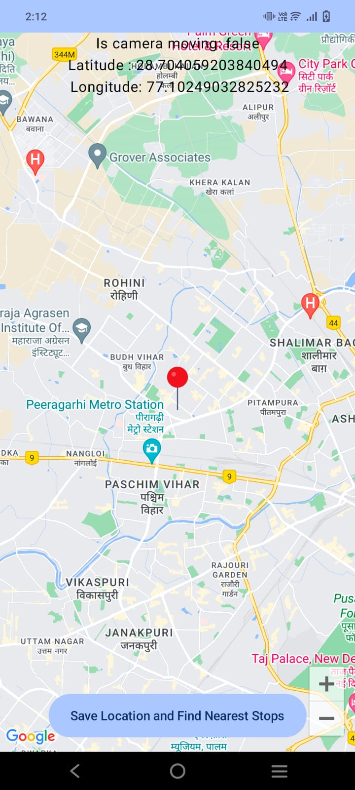
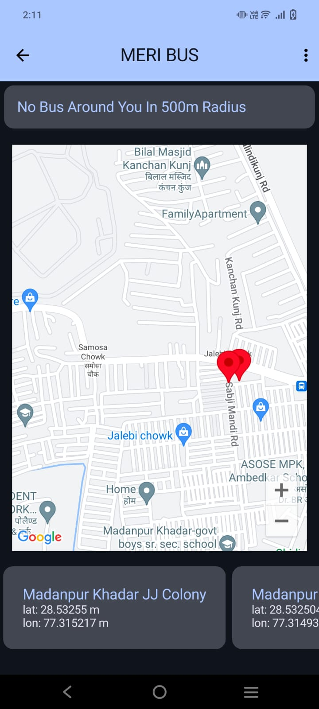
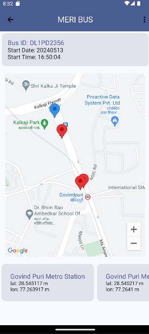
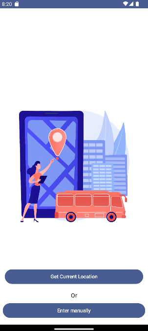

# Real-time Bus Tracking and Nearest Stops Application

## Description
This project is aimed at developing a real-time bus tracking and nearest stops application for a metropolitan area. The application leverages location sensors, the Open Transit API, Python FastAPI, Retrofit services, Google Maps API, and error management techniques to provide users with a user-friendly and efficient solution for tracking buses and finding nearby stops.

## Features
- Real-time bus tracking: Users can track buses in real-time on a map interface.
- Nearest stops identification: Users can identify the nearest stops for boarding or alighting.
- Manual location input: Users can input their location manually to find nearby buses and stops.
- Intuitive user interface: The application provides an intuitive and easy-to-navigate interface for seamless user experience.

## Technologies Used
- Python: Backend development
- FastAPI: REST API creation
- Retrofit: HTTP requests handling
- Google Maps API: Map visualization
- Android Kotlin: Frontend development
- Jetpack Compose: UI development

## Implementation Details
The project involves integrating various technologies and APIs to create a robust real-time bus tracking and nearest stops application. The backend is developed using Python and FastAPI, while the frontend is developed using Android Kotlin and Jetpack Compose. Retrofit is used for handling HTTP requests, and the Google Maps API is integrated for map visualization.

## Getting Started
To get started with the project, follow these steps:
1. Clone the repository to your local machine.
2. Set up the backend environment and deploy the FastAPI server.
3. Configure the frontend environment and run the Android Kotlin application.
4. Explore the application features and functionalities.

## Challenges Faced
Throughout the project, several challenges were encountered, including accessing and integrating real-time GTFS data, handling errors and exceptions, optimizing performance for real-time updates, and testing and debugging across multiple platforms. Strategies employed to overcome these challenges are discussed in detail in the documentation.

## Future Enhancements
To further enhance the application, future recommendations include improvements for scalability and performance, enhancements to the user interface and experience, integration with additional transit systems or APIs, and incorporation of advanced features such as predictive analytics.

## Documentation
- [Open Transit Delhi Documentation](https://otd.delhi.gov.in/documentation/)
- [Google Transit GTFS Documentation](https://developers.google.com/transit/gtfs/)
- [PythonAnywhere Hosting Service](https://www.pythonanywhere.com/user/lol1221/)
- [Google Maps Android SDK Documentation](https://developers.google.com/maps/documentation/android-sdk/maps-compose)

## Screenshots and Report
### Report
You can view the detailed project report [here](ABHISHEK_PPT.pdf).

### Screenshots
Here are some screenshots from the application:

#### Manual Location Input

#### Error When No Bus is Around

#### WhatsApp Image

#### Map Screen

#### Error Handling

#### Error

#### Loading Screen

#### Main Screen

## License
This project is licensed under the [MIT License](LICENSE).
